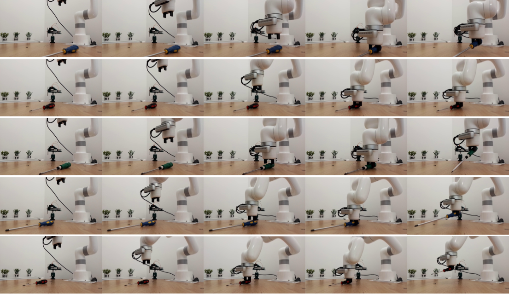

observation.image inside config file sholud be set on size 96 x 96.

Inside `robo_imitate` directory run follow commands:

```sh 
docker build --build-arg UID=$(id -u) -t robot_imitate .
```

```sh
docker run -v $(pwd)/robot_imitate/:/docker/app/robot_imitate:Z --gpus all -it -e DATA_PATH=robot_imitate/data/2024_09_09_19_47_17.parquet -e EPOCH=10 robot_imitate
```
